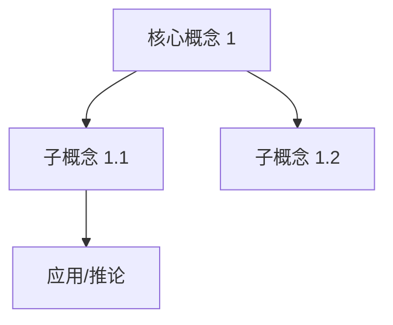

# {{TITLE_ZH}} / {{TITLE_EN}}

> [!abstract] 本节定位
> - **在课程中的位置**: 第 {{WEEK}} 周, L{{LECTURE_NUM}}
> - **前置知识**: [[]], [[]]
> - **本节核心**: (一句话)
> - **后续联系**: (将引向哪些后续内容)

---

## 知识结构

---

## 知识块 1 — {{BLOCK_TITLE}}

<!-- 写法见 references/workflow-detail.md §4「讲透标准」。下面的小节是骨架，不适用的删掉，不要留空标题。
     术语规则：首次出现的专业术语，粒子笔记有则 [[链接]]，没有则就地用 1-2 句定义 -->

**一句话直觉**: (大白话说清"这是在干什么"——先于任何定义和公式)

**为什么需要它**: (它要解决什么问题？没有它会怎样？)

(正式讲解：定义 / 机制。整合多页 slide 的内容，按逻辑而非页码组织。课件只点名没解释的术语，按标准教材口径讲清。)

$$公式$$

**解读**: (逐个符号说明含义)

**代入算一次**: (用具体的小数字代进去，让人看到量级 / 变化)

**走一遍例子**: (过程 / 算法类：用一个具体场景从头到尾走一遍每一步的状态)

![[图.png]]
> 看图要点: (看这张图时应该注意什么)

> [!warning] 常见坑
> (新手最容易理解错的地方，以及正确理解)

> [!tip] 延伸（非 PPT 内容）
> (仅限超出本讲范围的新知识点。本讲内容的讲解、例子、类比直接写在正文，不放这里。)

## 知识块 2 — ...

(继续按主题组织...)

---

## 对比与总结

| 对比维度 | 概念 A | 概念 B |
|---------|--------|--------|
| 定义 | ... | ... |
| 适用条件 | ... | ... |
| 关键区别 | ... | ... |

(仅在本讲涉及易混淆概念时使用,不强制。)

---

## 本节引入的核心概念

<!-- 手动列本讲首次引入、值得单独建概念页的术语；没有就删本段 -->

- [[]]
- [[]]

---

## 我的疑问

> [!question]
> 1. (具体、可操作的问题——能通过查资料或问老师回答的)
> 2. ...
> 3. ...

---

## 个人补充

> [!note] 我的理解
> (用户自己上课听到的、思考到的、和其他课联系起来的内容)

---

> [!info]- PPT 原文（Slides 1–N）
> **Slide 1**: (原文)
> **Slide 2**: (原文)
> ...
